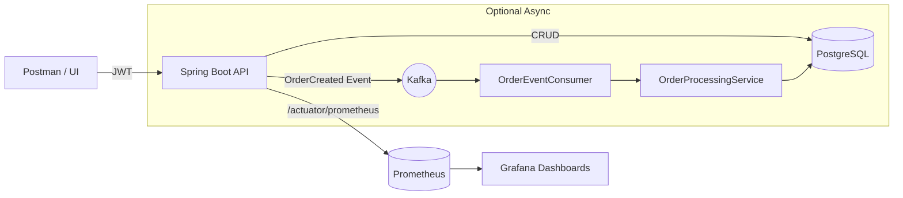

# 🍦 Ice Cream Shop — Event-Driven Orders & Observability

> A showcase microservice built with **Spring Boot** that manages ice-cream orders, demonstrates **JWT authentication & authorization**, **PostgreSQL** persistence, optional **Kafka** for event-driven flows, and end-to-end **observability** with **Micrometer → Prometheus → Grafana**. Designed to highlight secure APIs, clean domain modeling, and production-grade telemetry.

---

## 🔑 Elevator Pitch

Many CRUD apps lack real-time visibility and don’t scale cleanly to async flows.
**Ice Cream Shop** is an opinionated *orders* service that combines a secure REST API, robust persistence, and enterprise-level observability. It’s built to **tell a story** in interviews and portfolios: security, quality, and insight.

---

## ✨ Highlights

* **Security first:** JWT + roles (User/Admin), clear 401 vs 403 behavior, protected routes.
* **Observability first:** business metrics (login attempts, heartbeat, active orders), JVM & HTTP metrics, clean Grafana dashboard.
* **Event-Driven ready:** Kafka producer/consumer for order events, with a documented “no-Kafka” demo mode.
* **Clean domain:** separate DTOs & entities, explicit `Order`, `OrderItem`, `OrderStatus`.
* **DX for demos:** Postman collection with auto-token setup and story-driven requests (auth → access control → monitoring).

---

## 🧩 Architecture (at a glance)

* **Bounded Context:** Orders
* **Security:** Spring Security + JWT (role-based)
* **Persistence:** JPA/Hibernate + PostgreSQL
* **Telemetry:** Micrometer + Actuator → Prometheus → Grafana
* **Messaging (optional):** Kafka topic `order-events`

---

## 🧠 Domain & API (short)

* **Entities**
  `Order { orderId, customerName, customerEmail, totalAmount, status, items[] }`
  `OrderItem { flavor, size, quantity, pricePerUnit }`
  `OrderStatus ∈ { PENDING, PROCESSING, COMPLETED, CANCELLED }`
* **Key flows**
  **Auth:** Signup / Signin → JWT
  **Orders:** list, get by id, update status (admin only)
  **Ops:** `/actuator/health`, `/actuator/metrics`, `/actuator/prometheus`
* **Authorization demo**
  User → `PUT /orders/{id}/status` ⇒ **403**
  Admin → same request ⇒ **200**

---

## 📊 Observability (what I measure & why)

* **Business KPIs**
  `icecream.login.attempts.total` — authentication activity
  `icecream.active.orders` — current gauge
  `icecream_periodic_heartbeat_total` — liveness/heartbeat
* **Platform metrics**
  `http_server_requests_seconds_*` (rates by status 200/401/403/404)
  `process_uptime_seconds` (shown in hours)
  `jvm_memory_used_bytes` / `jvm_memory_max_bytes`

**Dashboard snapshot**: Uptime • Heartbeat rate • Login attempts • HTTP rate by status • JVM Heap %

---

## 🎬 “Story Demo” (what I show to reviewers)

1. **Auth:** Sign In → *Login Attempts* rises in Grafana.
2. **Security:** GET Orders without token ⇒ **401**; with user token ⇒ **200**.
3. **Authorization:** User tries to update status ⇒ **403**; Admin ⇒ **200**.
4. **Health:** Uptime climbs; Heartbeat stays steady; HTTP rate reacts to actions.
5. **Kafka (optional):** explain event-driven decoupling, scaling, retries; show graceful fallback when broker is off.

> The goal is to **demonstrate design maturity**, not just endpoints.

---

## 🏗️ Tech Stack

**Java 17, Spring Boot 3.5.4, Spring Security (JWT), Spring Data JPA, PostgreSQL, Kafka (optional), Micrometer, Spring Actuator, Prometheus, Grafana, Maven, Docker Compose, Postman.**

---

## 🔬 Code Quality & Practices

* Layered architecture; DTOs ≠ Entities
* Input validation & consistent error handling
* 12-factor configuration
* Observability-first (useful labels, actionable panels)
* Security-first (role-based access, least privilege)

---

## 🛠️ Challenges & Lessons

* Clear UX for **401 vs 403** in real demos.
* Designing a **no-Kafka mode** so business logic isn’t hard-coupled to the broker.
* **Observability that tells a story**: choosing metrics that reflect business behavior, not only infra.
* Minimal, readable Grafana panels with meaningful time windows and refresh.

---

## 🚀 Roadmap

* Swagger/OpenAPI UI
* Testcontainers for integration (DB + Kafka)
* Grafana alerting (4xx/5xx spikes, error budgets)
* Mock producer for graceful no-Kafka operation
* Rate limits & audit trail

---

## 📁 Repo Assets

* `Ice-Cream-Shop-API.postman_collection.json` — Postman collection
* `grafana-dashboard.json` — importable Grafana dashboard

---

## 👤 Author

**Eduard Drăghici** — Business × IT; security, observability, and pragmatic architecture.

> *This project is built to showcase how I approach **security**, **observability**, and **modularity** in a service that is small, but “production-ready by design.”*
